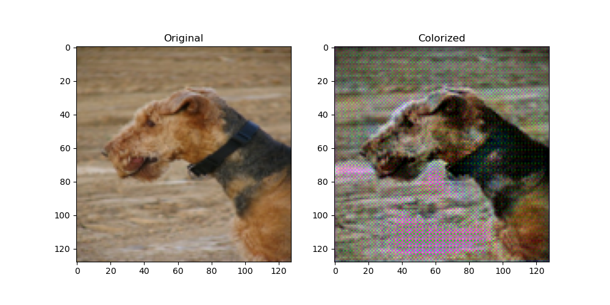
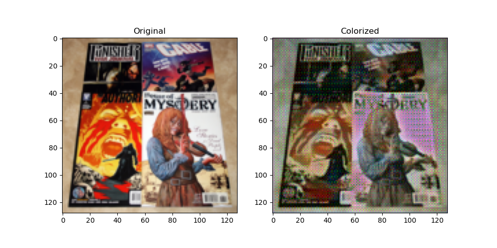

# Artistic colorisation with Adaptive Istance Normalization

### 🧑🏻‍🎓 Team Members

| Name and surname    |  Matric. Nr. | GitHub username  |   e-mail address   |
|:--------------------|:-------------|:-----------------|:-------------------|
| Alexander Nyamekye |  *(?)* | nalexunder | alexander.nyamekye@stud.uni-heidelberg.de|
| Cristi Andrei Prioteasa |  	4740844 | PrioteasaAndrei | cristi.prioteasa@stud.uni-heidelberg.de|
| Matteo Malvestiti | 4731243| Matteo-Malve | matteo.malvestiti@stud.uni-heidelberg.de|
| Jan Smolen |  *(?)* |  *(?)*  | wm315@stud.uni-heidelberg.de|

### Advisor

Denis Zavadski: denis.zavadski@iwr.uni-heidelberg.de

***

## Table of contents

1. [Introduction](#introduction)
2. [Motivation](#motivation)
3. [Related Work](#related_work)
4. [Approach](#approach)
5. [Conclusion](#conclusion)

# 1. Introduction

Colorization of grayscale images has been an area of significant interest in computer vision, with applications ranging from photo restoration to artistic expression. We propose an approach to colorizing grayscale images in various artistic styles using a U-Net architecture enhanced with Adaptive Instance Normalization (AdaIN) layers. U-Net, known for its effectiveness in semantic segmentation tasks, provides an ideal framework for our colorization task due to its ability to capture spatial dependencies while preserving fine details. By incorporating AdaIN layers into the U-Net architecture, we introduce the capability to adaptively transfer artistic styles (here we use style to refer to color choices) from reference images to grayscale inputs. AdaIN enables the decoupling of content and style in feature representations, allowing us to leverage the content information from grayscale images while infusing them with the stylistic characteristics extracted from reference color images. This style-guided colorization approach opens up new possibilities for artistic expression, allowing users to apply various painting styles, from impressionism to surrealism, to grayscale inputs.

# 2. Motivation
This project has his roots in our fascination for the colorisation task: an underconstraied task that is still under research and has big room for improvements. It is mathematically impossible to deduce from the single channel of grayscale images the 3 RGB or LAB channels. The only certainty is the color intensity pixel per pixel, but it is necessary to "guess" the colors.
Deep Convolutional Neural Networks are a powerful tool to tackle this task, since they can learn to understand the semantics of the image itself.
Moreover the AdaIN encoder, if used in training on the ground truth colored image itself, can be a powerful tool to encode the colour semantics. This addition alone, consisting in a regularisation and having yet no capacity to do style transfer, lead to a great improvement in colorisation quality.

The first idea of our group was less ambitious, namely to train a UNet for colorisation and finetuining it on different style images, like paintings of certain styles, and to present the user a limited choice of styles to colorise its uploaded grayscale iamge.
Our tutor, though, immediately introduced us to Adaptive Instance normalization, which, after a careful read of the related scientific paper ([Arbitrary Style Transfer in Real-time with Adaptive Instance Normalization](https://arxiv.org/abs/1703.06868)), we thought to be facinating and we immediately took as primary objective.

# 3. Related work
Our first struggle was definitely to train a Neural Network that was able to recreate first, and then to colorise images. We started from an encoder-decoder architecture that had a pretrained VGG19 encoder, discarding the classification head. The idea was to save a lot on computational cost. Unfortunately it wasn't enough: if we froze the encoder and trained the decoder alone, we were underfitted. If we unfroze the encoder, VGG19 was simply not worth it. Indeed, it was a big network, taking a lot of comptuational resourses, but at the same time it didn't offer skip connections or the flexibility to insert AdaIN layers, not while wanting to load the pretrained weights at least.

Anyways, this was a big part of our first two weeks of work. The paper we were getting inspiration from was: [Arbitrary Style Transfer in Real-time with Adaptive Instance Normalization](https://arxiv.org/abs/1703.06868), but mainly its unofficial implementation from the GitHub repository [GitHub: naoto0804/pytorch-AdaIN](https://github.com/naoto0804/pytorch-AdaIN).

Our first results in recreation and colorisation came when we started following the approach described in [Image Colorization using U-Net with Skip Connections and Fusion Layer on Landscape Images](https://arxiv.org/abs/2205.12867). It was recreating manually layer by layer their UNet that we overcame our troubles.

The next step, namely the introduction of AdaIN layers for regularisation, was discussed in a meeting with our tutor and had no direct backup from scientific papers. The Adaptive Instance Normalization is done like in [Arbitrary Style Transfer in Real-time with Adaptive Instance Normalization](https://arxiv.org/abs/1703.06868), but with a big difference: the parameters of mean and standard deviation are learned every time from simple linear layers that act as interfaces between the latent space of the AdaIN encoder and the feature maps where normalization takes place. If you refer to the big architecture map in the beginning of this documentation, we are talking about the blue pins.
This idea of learning the AdaIN parameters comes from NVIDIA's 2019's [StyleGAN paper](https://openaccess.thecvf.com/content_CVPR_2019/papers/Karras_A_Style-Based_Generator_Architecture_for_Generative_Adversarial_Networks_CVPR_2019_paper.pdf).

# 4. Approach
## 4.1 The Architecture

  

Let us explain our architecture step by step.

#### The baseline UNet
The main core of the NN is the central UNet. UNet is still state of the art at this day and it's particularly effective for segmenting images. This knowledge is exactly what we needed for our colorization task.
The encoder consists in convolutions with 3x3 filters, always followed by ReLu and batch normalization, which are indicated in the picture by the orange slices on the right side of the convolution blocks.
After every set of convolutions a max pooling layer halves the feature maps dimensions.
The bottleneck maintains a reasonable size: 1/16 of the original size. As we work with 128x128 images due to computational cost limitations, this means that the bottleneck feature maps have size 8x8.

The decoder doesn't exactly mirror the encoder, but present the same jumps in number of chanels and dimension of the feature maps. Upsampling is done through transpose convolution. Relu and batch normalization are applied also in the decoder as can be seen by the orange slices.

The most notable featue of the UNet are the skip connections. We have five. Every time we concatenate the respective feature maps in the encoder to the newly upscaled featuremaps of the decoder. Then we fuse them together with 1x1 convolutions.

This network alone was able to perform recreation of images and colorisation.

The UNet architecture with AdaIN layers presented here is designed for grayscale image colorization in different artistic styles. It consists of an encoder-decoder structure with skip connections, allowing for both feature extraction and spatial detail preservation. The network expects input in the form of $[C,H,W]$, where the number of channels $C$ can be 2 for the LAB colorspace and 3 for the RGB colorspace. We chose to train our model using the RGB color space because the LAB tranformation introduce a number of artefacts from numerical instability of the transformation which yielded poorer results.

#### The addition of Adaptive instance normalization

## 4.2 Training & Dataset

We decided to use the [imagenet-1k](https://huggingface.co/datasets/imagenet-1k) dataset for our training. For our style colorization and later fine-tuning we use the [wikiart](https://huggingface.co/datasets/huggan/wikiart) dataset. We chose a training size of 5000 samples and train for 100 epochs using an Adam optimizer with a learning rate of $1e^{-3}$. We further fine tune on ... artistic images.

** insert graph loses from matteo here **

## 4.2 Experiments and hyperparameters

Since we didn't have available computing resources, we used a personal NVIDIA GeForce RTX 3050TI mobile, 4096MiB VRAM and an Mac M1 for training. (16 GB RAM). This limits our ability in terms of resolution of the input images. Training with patches of size $256 \times 256$ yielded poor results even after prologed training, but using patches of size $128 \times 128$ yields decent results which generalize.

We experiment with two types of losses: MSE against the original image and [Learned Perceptual Similarty](https://github.com/richzhang/PerceptualSimilarity), as a way to encourage the network to learn semanting colorization information about the image instead of faithfully reproducting the colors of the original image. We use a weighted sum of both losses for our training.

When using only LPIPS for our loss function, our output images present artefacts. We would need to further investigate the causes of this.

  
  

 
When using only MSE for our loss function we get better results, we obtain more meaningful results, but with a considerable greater amount of training. Thus, we settle on a weighed mean of the two which yields good results.

** TODO: insert here our best results **

  
  

There are also images for which colorization fails completly and outputs noise:

  

** TODO: insert results from style transfer ** 

# 5. Conclusion

In conclusion, we have presented a novel UNet architecture enhanced with Adaptive Instance Normalization (AdaIN) layers for grayscale image colorization in diverse artistic styles. 