# Artistic colorisation with Adaptive Istance Normalization

### 🧑🏻‍🎓 Team Members

| Name and surname    |  Matric. Nr. | GitHub username  |   e-mail address   |
|:--------------------|:-------------|:-----------------|:-------------------|
| Cristi Andrei Prioteasa | 4740844| PrioteasaAndrei | cristi.prioteasa@stud.uni-heidelberg.de|
| Matteo Malvestiti | 4731243| Matteo-Malve | matteo.malvestiti@stud.uni-heidelberg.de|
| Jan Smoleń | 4734263| smolenj | wm315@stud.uni-heidelberg.de|


### Advisor

Denis Zavadski: denis.zavadski@iwr.uni-heidelberg.de

***

### Setup

```bash
conda env create -f environment.yml --name colorization
conda activate colorization
streamlit run gui/demo.py -- --model_path=models/RGB_Latent32_best_model.pth.tar
```
Use the graphical interface to upload style and contet images. The images will be automatically resized to $128px\times128px$. The model takes only 400 MB, so it should work on most low-end devices.

NOTE: a Huggingface token is needed to run the training / download the dataset (this is not necessary to run the forward pass of the network). Create a .env file in the main directory and add `HUGGING_FACE_TOKEN='YOUR TOKEN'`.

### Project Structure
```
├── gui <----------- streamlit app
├── images <---------- various images saved along the project developement
├── implicit-UNet-AdaIN <----------------- network and training
│   ├── implicit_scarsity_experiments <---------------- experiment results
│   ├── samples <-------------------- validation samples
│   └── samples_organized <--------------- validation samples in a more human readable format
├── models <---------------------- model checkpoint
└── Unet_adain <---------------------- older versions of the model checkpoints
    └── combined_losses_experiments
```

## Table of contents

1. [Introduction](#introduction)
2. [Motivation](#motivation)
3. [Related Work](#related_work)
4. [Approach](#approach)
5. [Troubles, experiments and reflections: The evolution of the project](#troubles)
6. [The final Model](#final-model)
7. [Conclusion](#conclusion)
8. [Appendix](#appendix)

# <a name="introduction"></a>1. Introduction

Colorization of grayscale images has been an area of significant interest in computer vision, with applications ranging from photo restoration to artistic expression. We propose an approach to colorize grayscale images in various artistic styles using a U-Net architecture enhanced with Adaptive Instance Normalization (AdaIN) layers. U-Net, known for its effectiveness in semantic segmentation tasks, provides an ideal framework for our colorization task due to its ability to capture spatial dependencies while preserving fine details. By incorporating AdaIN layers into the U-Net architecture, we introduce the capability to adaptively transfer artistic styles (here we use style to refer to color choices) from reference images to grayscale inputs. AdaIN enables the decoupling of content and style in feature representations, allowing us to leverage the content information from grayscale images while infusing them with the stylistic characteristics extracted from reference color images. This style-guided colorization approach opens up new possibilities for artistic expression, allowing users to apply various painting styles, from impressionism to surrealism, to grayscale inputs.


# <a name="motivation"></a>2. Motivation
This project has his roots in our fascination for the colorisation task: an underconstraied task that is still under research and has big room for improvements. It is mathematically impossible to deduce from the single channel of grayscale images the 3 RGB or LAB channels. The only certainty is the color intensity pixel per pixel, but it is necessary to "guess" the colors.
Deep Convolutional Neural Networks are a powerful tool to tackle this task, since they can learn to understand the semantics of the image itself.
Moreover the AdaIN encoder, if used in training on the ground truth colored image itself, can be a powerful tool to encode the colour semantics. This addition alone, consisting in a regularisation and having yet no capacity to do style transfer, lead to a great improvement in colorisation quality.

<!-- The first idea of our group was less ambitious, namely to train a UNet for colorisation and finetuining it on different style images, like paintings of certain styles, and to present the user a limited choice of styles to colorise its uploaded grayscale iamge.
Our tutor, though, immediately introduced us to Adaptive Instance normalization, which, after a careful read of the related scientific paper ([Arbitrary Style Transfer in Real-time with Adaptive Instance Normalization](https://arxiv.org/abs/1703.06868)), we thought to be facinating and we immediately took as primary inspiration.

There are three big differences between our approach and the forementioned paper:
1) Our network also colorizes images, rather than just transfering style.
2) Our Adaptive Instance Normalization is applied after every block of convolution, rather than just once on the bottlenck of the UNet.
3) The mean and standard deviations used in our AdaIN are not deterministic but are learned as well. -->

# <a name="related_work"></a>3. Related work

Most of the related work deals with the non-parameter version of AdaIN, as introduced in the [Arbitrary Style Transfer in Real-time with Adaptive Instance Normalization](https://arxiv.org/abs/1703.06868) or work with some sort of Generative Adversarial Networks as they are more expressive and better suited for this task. There are three main approaches in the literature of UNet based colorization: combining color and texture in the transformation (called style), colorizing without any style information, such as in [Image Colorization using U-Net with Skip Connections and Fusion Layer on Landscape Images](https://arxiv.org/abs/2205.12867) (which served as an initial starting point for our work) or considering color and texture separatly and allowing for a controllable blend between the two (see [Aesthetic-Aware Image Style Transfer](http://hcsi.cs.tsinghua.edu.cn/Paper/Paper20/MM20-HUZHIYUAN.pdf
)). In our work we deal only with color transfer in different styles and no texture transfer.
We analyze [Analysis of Different Losses for Deep Learning Image Colorization](https://arxiv.org/pdf/2204.02980.pdf) and conclude that the a more complicated colorization loss does not lead to significantly better results.

<!-- Anyways, this was a big part of our first two weeks of work. The paper we were getting inspiration from was: [Arbitrary Style Transfer in Real-time with Adaptive Instance Normalization](https://arxiv.org/abs/1703.06868), together with its unofficial implementation from the GitHub repository [GitHub: naoto0804/pytorch-AdaIN](https://github.com/naoto0804/pytorch-AdaIN). -->


# <a name="approach"></a>4. Approach
## <a name="architecture"></a>4.1 Architecture
<p align="left">
  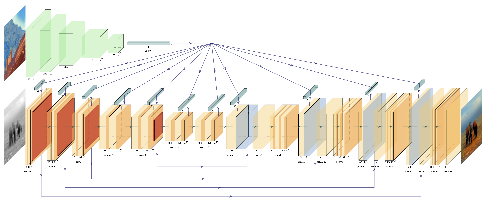
</p>


#### The baseline UNet
The central component of our architecture is the [UNet](https://arxiv.org/abs/1505.04597), which remains a state-of-the-art solution for image segmentation, making it an ideal choice for our colorization task. The encoder comprises a series of convolutional layers with 3x3 filters, each followed by a ReLU activation and batch normalization. This structure is visually represented by the orange segments in the diagram adjacent to the convolution blocks. Following each set of convolutions, a max-pooling layer reduces the feature map dimensions by half.

The bottleneck section reduces the spatial resolution to 1/16 of the original, aligning with the computational constraints of working with 128x128 images. Thus, the bottleneck feature maps have a size of 8x8.

The decoder does not precisely mirror the encoder, but it maintains the same patterns of changes in channel counts and feature map dimensions. Upsampling is achieved using transpose convolution. Similarly, ReLU activations and batch normalization are applied throughout the decoder, indicated by the orange segments.

A distinguishing feature of UNet is the use of skip connections. In this configuration, there are five skip connections. At each skip connection, the feature maps from the encoder are concatenated with the corresponding upscaled feature maps from the decoder. These concatenated feature maps are then processed using 1x1 convolutions to fuse them.

The network expects input in the form of $[C,H,W]$, where the number of channels $C$ can be 2 for the LAB colorspace and 3 for the RGB colorspace. We chose to train our model using the RGB color space because the LAB tranformation introduces a number of artefacts from numerical instability of the transformation which yields poorer results.

Together, this architecture forms the backbone of our neural network, providing a robust and efficient structure for the image colorization task.

This network alone (without the style encoder and AdaIN layers) was tested in a preliminary phase and resulted to be able to perform both the recreation of images and colorisation, although with notable overfitting problems.

Below you can see:
1) Loss curves for only UNet tasked with colorization
2) Colorization performance on a training image
3) Colorization performance on a test image (never seen before)
<p align="center">
  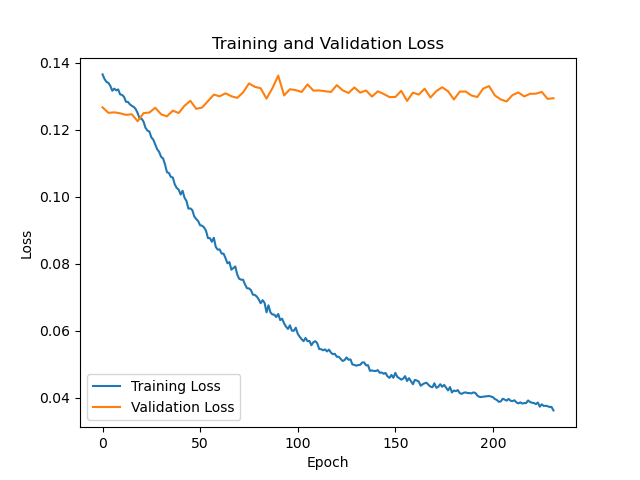
  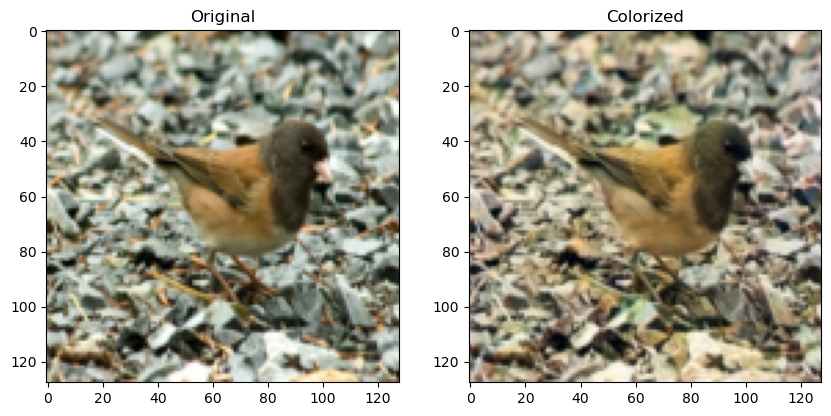
  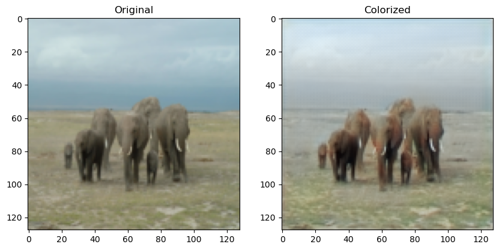
</p>

The results were achieved using the following network configuration:

<table align="center">
  <tr>
    <th>Train dataset size</th>
    <td>2000</td>
  </tr>
  <tr>
    <th>Validation dataset size</th>
    <td>200</td>
  </tr>
  <tr>
    <th>Batch size</th>
    <td>16</td>
  </tr>
  <tr>
    <th>Epochs trained</th>
    <td><span style="color:orange">231</span></td>
  </tr>
  <tr>
    <th>Colorspace</th>
    <td>RGB</td>
  </tr>
  <tr>
    <th>Optimizer</th>
    <td>Adam w. Weight decay</td>
  </tr>
  <tr>
    <th>Notes:</th>
    <td>Dropout used as regul.</td>
  </tr>
</table>


#### Adaptive Instance Normalization and Style Encoder

In order to achieve style transfer (only colour) we augument the base Unet with two additional components: a style encoder which encodes the color features of the original image(we will later discuss why only the color features and not also the texture features of the original image are encoded) and AdaIN layers which align the style feature maps with the content image feature maps.

We implement a version of Adaptive Instance Normalization as in the original [Style GAN paper](https://arxiv.org/pdf/1812.04948.pdf), given by (see paper for full description of the terms):
$$
AdaIN(xi, y) = y_{s,i} \times \frac{x_i − μ(xi)}{σ(xi)} + y_{b,i}
$$

This layers aims to align per channel the mean and variance of the feature space of the encoded style image with the feature maps of the original image at different depths in the network using learned affine transformations (MLPs in our network), in this way achieving style tranfer (color transfer). 

The AdaIN encoder runs only one per epoch, embedding the style image in a compressed latent space. After every block of convolutions, followed by ReLu activations and batch normalization, the feature maps get normalized with the mean and std of the adain interface. Since in the different stages of the UNet the feature maps have different channel sizes, a dense linear layer is put in between the AdaIN latent space and the feature maps.

The style encoder is a simple encoder followed by a Global Average Pooling (GAP) layer, which encodes the colour features in a latent space dimension of $32$ (we later discuss how the dimension of the latent space influences the colorization and style transfer).

## <a name="architecture"></a>4.2 Training & Dataset

Since we didn't have available computing resources, we used a personal laptop with NVIDIA GeForce RTX 3050TI, 4096MiB VRAM and a M1 MacBook Air (16Gb RAM) for training. This limit our ability in terms of resolution of the input images. Training with patches of size $256 \times 256$ yielded poor results even after prologed training, but using patches of size $128 \times 128$ yields decent results which generalize.

We experiment with two types of losses: MSE against the original image and [Learned Perceptual Similarty](https://github.com/richzhang/PerceptualSimilarity), as a way to encourage the network to learn semantic colorization information about the image instead of faithfully reproducting the colors of the original image. We use a weighted sum of both losses for our training.

#### Implicit training
During training we pass as style image the colour original image itself.
Then, we train on colorizing the grayscale image, computing the loss of the recreated image against the original colour image. The loss is a combination of MSE pixel by pixel and of [learned perceptual similarity](https://github.com/richzhang/PerceptualSimilarity). We use learned perceptual similarity (LPIPS) as it gives the network more freedom in learning semantically equivalent colors for different regions, instead of learning to reproduce the exact color from the training set. During backpropagation the various AdaIN interfaces and the encoder get implicitly trained.

In the final version of the model, there is no training against different style images. This approach was tried and will be discussed futher ahead. It needs the definition of a new style loss and good balancing with the colorization loss. Anyways, this should not be necessary: so long as scarcity is induced in the baseline UNet, it should resort in relying on the encoded data of the style image, provided by AdaIN interface. Thus, when passing a new style image at inference time, this implicit training should be enough to transfer the style.

#### Dataset


We use the [imagenet-1k](https://huggingface.co/datasets/imagenet-1k) dataset for our training. We experiment with different training set size and for our final model we use 50k training images and 500 validation images. As style images to test at inference phase, we sample from the [wikiart](https://huggingface.co/datasets/huggan/wikiart) dataset.

#### Training analysis
<span style="color:red"> 	insert graph loses from latest model here </span>
<p align="center">
  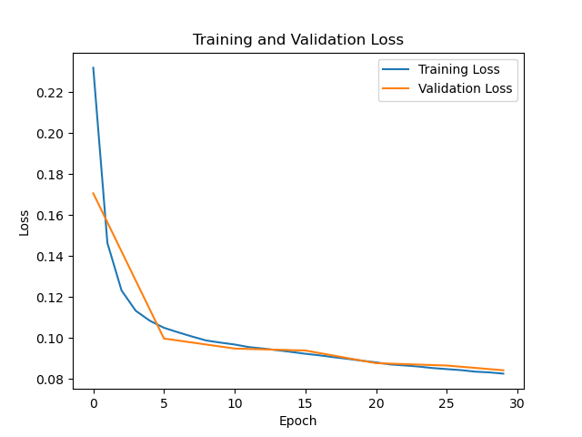
  Loss curves of the final model. All details about the model in the next section
</p>


# <a name="troubles"></a>5. Experiments and ablation studies
In this section we present a reorganized history of the thought process that led us to the final prothotype.
This will only contain the most crucial experiments, those from which we learned somthing that brought us a step closer to out goal. Many more experiments were done, like those on the LAB colorspace, and they can be found in the [Appendix]().

### Achieving colorization without style transfer

Our first struggle was definitely to train a Neural Network that was able to recreate first, and then to colorise images. We started from an encoder-decoder architecture that had a pretrained VGG19 encoder, discarding the classification head. The idea was to save a lot on computational cost. Unfortunately it wasn't enough: if we froze the encoder and trained the decoder alone, we were underfitted. If we unfroze the encoder, VGG19 was simply not worth it. Indeed, it was a big network, taking a lot of comptuational resourses, but at the same time it didn't offer skip connections or the flexibility to insert AdaIN layers, not while wanting to load the pretrained weights at least.

Our first results in recreation and colorisation came when we started following the approach described in [Image Colorization using U-Net with Skip Connections and Fusion Layer on Landscape Images](https://arxiv.org/abs/2205.12867). It was by manually recreating layer by layer their UNet that we overcame our troubles.

### Introducing style stransfer using AdaIN layers

The next step, namely the introduction of AdaIN layers for regularisation, was discussed in a meeting with our tutor and had no direct backup from scientific papers. The Adaptive Instance Normalization is done like in [Arbitrary Style Transfer in Real-time with Adaptive Instance Normalization](https://arxiv.org/abs/1703.06868), but with a big difference: the parameters of mean and standard deviation are learned every time from simple linear layers that act as interfaces between the latent space of the AdaIN encoder and the feature maps where normalization takes place. If you refer to the big architecture map in the beginning of this documentation, we are talking about the blue pins.
This idea of learning the AdaIN parameters comes from NVIDIA's 2019's [StyleGAN paper](https://openaccess.thecvf.com/content_CVPR_2019/papers/Karras_A_Style-Based_Generator_Architecture_for_Generative_Adversarial_Networks_CVPR_2019_paper.pdf).


### Null style latent space

For the following section, the experiments were conducted using the following configuration:

<table align="center">
  <tr>
    <th>Train dataset size</th>
    <td>50000</td>
  </tr>
  <tr>
    <th>Validation dataset size</th>
    <td>500</td>
  </tr>
  <tr>
    <th>Batch size</th>
    <td>16</td>
  </tr>
  <tr>
    <th>Epochs trained</th>
    <td>18</td>
  </tr>
  <tr>
    <th>Colorspace</th>
    <td>RGB</td>
  </tr>
  <tr>
    <th><span style="color:orange"> Latent space dimension</span></th>
    <td><span style="color:orange"> 128</span></td>
  </tr>
  <tr>
    <th>Epochs</th>
    <td>32</td>
  </tr>
</table>


AdaIN (Adaptive Instance Normalization) was effectively disregarded by the baseline UNet architecture. After a few iterations, the latent space in the AdaIN encoder was driven entirely to zero (see next image), indicating that the network was suppressing its influence in favor of straightforward reconstruction. As a result, during the inference phase, when different style images were input, there was no noticeable effect on the output, demonstrating that the style information was not contributing to the reconstructed image.

<p align="center">
  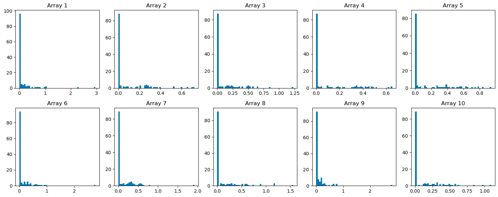
  Histogram of random samples from the style latent space.
</p>

#### Attempt 1: training with different pairs of (context + style) images
To achieve this, we build a new dataloader that sampled pairs of context and style iamges and we fed them both to the network. The forward pass is pretty intuitive. The backward pass needed some more careful thinking though.
Our first idea was to introduce a new loss, thus distinguishing between colorization and style loss.
The colorization loss was exactly the same as before, a linear combination of MSE and lpips between recreated image and original colur image.

The style loss was obtained in the following way:
1) We stored the latent space of the AdaIN encoder, namely the embedding of the style image
2) After the forward pass, without computing the gradient, we passed the recreated image through the AdaIN encoder, thus obtaining the embedding of the recreated image
3) We computed MSE between the two latent spaces
The final loss was a weighted linear combination of the two losses.

We hoped to manually force the network to learn style transfer, but we were unfortunately stopped by a very basic inconvenience: the balancing of the two losses. Indeed, the colorization loss was of the order of magnitude of $10^{-2}$ or $10^{-3}$, while the style loss, which we rember was computed on the embdeeings obtained throught the same encoder, was much lower, woth values oscillating between $10^{-5}$ and $10^{-8}$. We realised that without additional learning techniques, we would have never found an optimal way to balance these two losses. Using a sigmoid function for the style encoder ensured that the two losses were now in the same range, but that did not make any difference in the training process. The combined loss was defined as $$combined_loss = α \times color_loss + (1-α) \times style_loss$$

<!-- <table align="center">
  <tr>
    <th>Train dataset size</th>
    <td>5000</td>
  </tr>
  <tr>
    <th>Validation dataset size</th>
    <td>500</td>
  </tr>
  <tr>
    <th>Batch size</th>
    <td>12</td>
  </tr>
   <tr>
    <th>Colorspace</th>
    <td>RGB</td>
  </tr>
  <tr>
    <th><span style="color:orange"> combined_loss = α•color_loss + (1-α)•style_loss</span></th>
    <td><span style="color:orange"> α = 0.5</span></td>
  </tr>
</table> -->

<p align="center">
  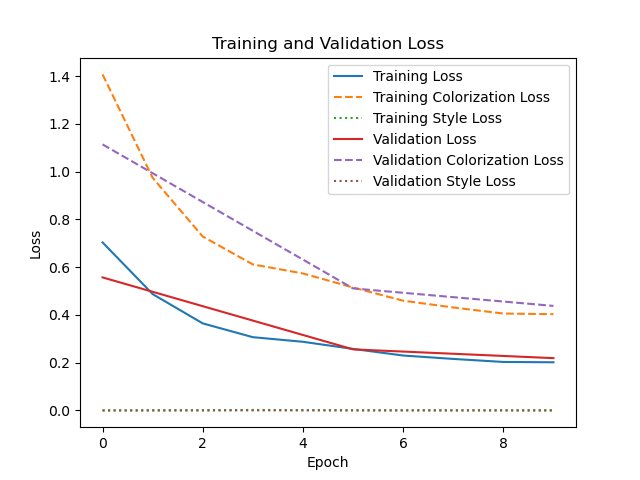
</p>


#### Attempt 2: using two different optimizers
The dual-opt model was exactly what it seems from the name: at every iteration we executed two forward passes and two backward with two different optimizers and loss functions: first the colorization loss and then the style loss. More importance was given to the colorization by passing the optimizer a learning rate 10 times higher than the one of the style optimizer.

We soon experienced bad results: 
- ⁠The loss of the style optimizer, although small, wasn't converging at all. Not in the first 15 epochs at least.
- ⁠⁠The loss of the colorization optimizer was better, but polluted by the constant meaningless changes of the style optimizer.

Soon we would realise, by investigating the values of the latent space of the AdaIN encoder, that it was cast to zero by the backpropagation of the colorization optimizer, cutting out all its power to represent the style input. The style optimizer had little of sense to work on, leading just to worse and worse results.

The dual-opt approach was not viable in the brutal state we described and tested. One way to refine it would have been to associate with each optimizer only certain parameters, especially allowing the colorization optimizer only to backpropage on the baseline UNet.

But actually, the takeaway from this experiments was learning how the training proceeded, how the weights were cast to zero by the colorization loss and also how we were underestimating the capabilities of the AdaIN encoder.
The whole point of leaning the adain parameters was intended for implicit training, for letting it learn the true colour semantics of the style image, withouth forcing the network exterally with different couples of content and style-images.


### Final solution

For this section the following configuration is used:


<table align="center">
  <tr>
    <th>Train dataset size</th>
    <td><span style="color:orange"> 50.000</span></td>
  </tr>
  <tr>
    <th>Validation dataset size</th>
    <td>500</td>
  </tr>
  <tr>
    <th>Batch size</th>
    <td>16</td>
  </tr>
   <tr>
    <th>Colorspace</th>
    <td>RGB</td>
  </tr>
  <tr>
    <th>AdaIN encoder latent space dimension</th>
    <td> 32</td>
  </tr>
  <tr>
    <th><span style="color:orange"> Dropout rate after every convolution</span></th>
    <td><span style="color:orange"> 0.2</span></td>
  </tr>
  <tr>
    <th>Epochs</th>
    <td>32</td>
  </tr>

</table>


<!-- <table align="center">
  <tr>
    <th>Train dataset size</th>
    <td>5000</td>
  </tr>
  <tr>
    <th>Validation dataset size</th>
    <td>500</td>
  </tr>
  <tr>
    <th>Batch size</th>
    <td>16</td>
  </tr>
  <tr>
    <th>Colorspace</th>
    <td>RGB</td>
  </tr>
  <tr>
    <th><span style="color:orange"> AdaIN encoder latent space dimension</span></th>
    <td><span style="color:orange"> 32</span></td>
  </tr>
</table> -->

The solution was to introduce scarsity in the baseline UNet, so that it would look into the style representation, instead of trying to recreate itself perfectly and cast all the AdaIN parameters to 0. We rewrote the UNet to be much lighter, by reducing the number of channels to $1/4$ throughout the whole network and all skip connections and AdaIN pins respectively.
Another change was reducing the latent space of the AdaIN encoder from size 128 to size 32.

<!-- 
<p align="center">
  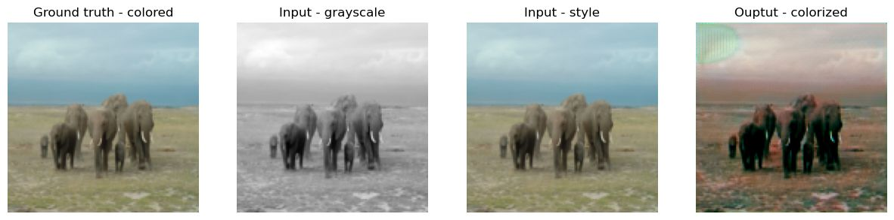
  
</p> -->

After introducing dropout layers and training for 32 epochs on 50k training images we obtain clear colorization and style transfer. The style latent space is no longer null and we can see the different modes for different characteristics of the style image.

<p align="center">
  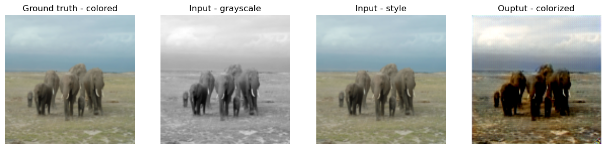
  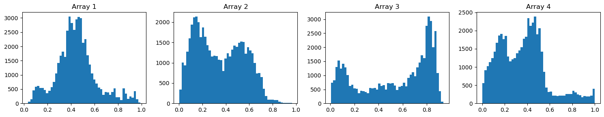
  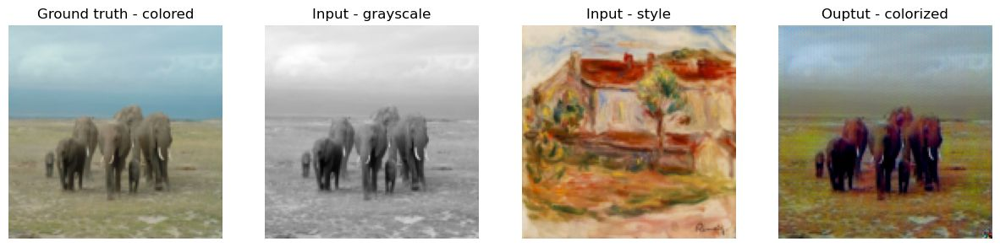
  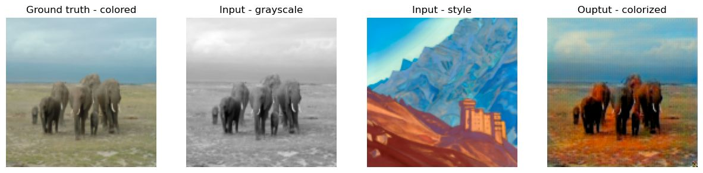
  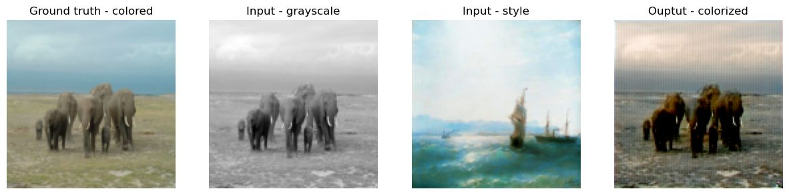
</p>
<!-- 
### Final model

We come to the final configuration of our model. We increase the training size to 100k and change the dropout rate to 0.2. With this configuration we are able to obtain meaningful results.

<table align="center">
  <tr>
    <th>Train dataset size</th>
    <td><span style="color:orange"> 100.000</span></td>
  </tr>
  <tr>
    <th>Validation dataset size</th>
    <td><span style="color:orange"> 1.000</span></td>
  </tr>
  <tr>
    <th>Batch size</th>
    <td>16</td>
  </tr>
   <tr>
    <th>Colorspace</th>
    <td>RGB</td>
  </tr>
  <tr>
    <th>AdaIN encoder latent space dimension</th>
    <td> 32</td>
  </tr>
  <tr>
    <th>Dropout rate after every convolution</th>
    <td><span style="color:orange"> 0.1</span></td>
  </tr>
  
</table> -->

The next are results from our final model:

<h3 align='center'> Exotic bird </p>
<p align="center">
  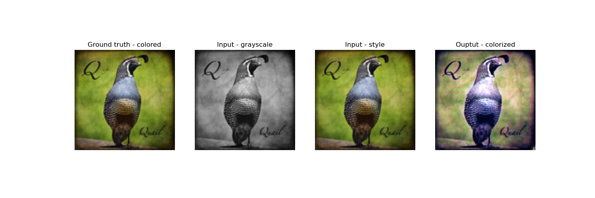
  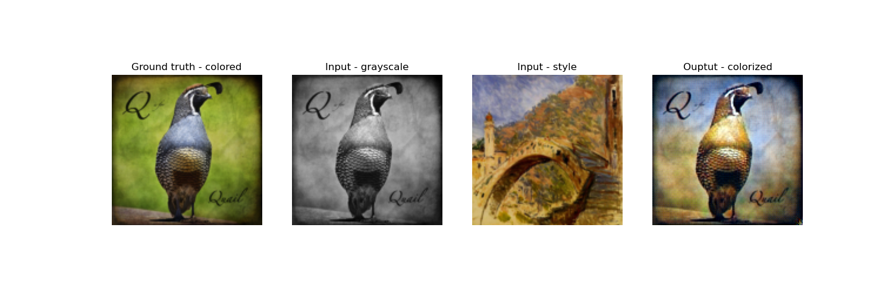
  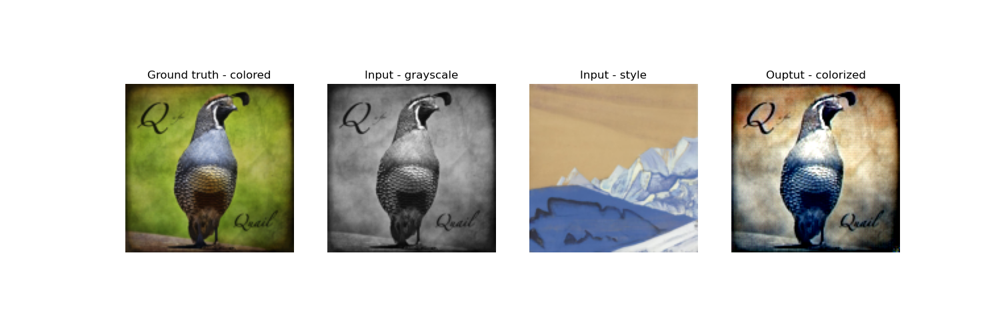
  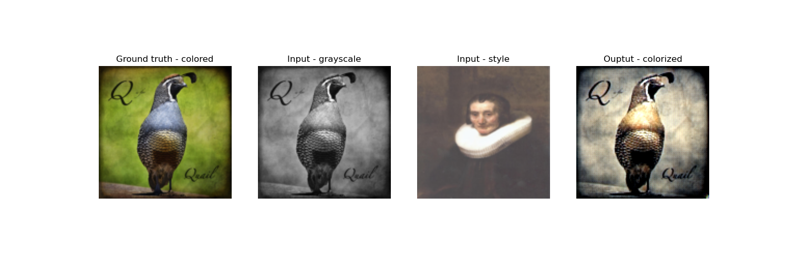
</p>

See Appendix for more result samples.

# <a name="conclusion"></a>7. Conclusion

In conclusion, we have presented a novel UNet architecture enhanced with Adaptive Instance Normalization (AdaIN) layers for grayscale image colorization in diverse artistic styles. We achieve good colorization results and clear style transfer, while keeping the network lightweight (3.5M parameters) and can fit on consumer grade GPUs. We conducted experiments on the influence of the latent space dimension and investigated the expressiveness of the network in term of depth and number of parameters. We investigated different normalization techniques, influence of the used colorspace (RGB vs LAB) and texture vs color transfer.


# <a name="appendix"></a>Appendix

## Further experiments
In this extra section we outline some of the experiments that didn't make it to the final cut and that didn't present meaningful results toward our goal. Nonetheless they were an interesting study and give the full picture on the efforts put into this project.

### Using only LPIPS (Learned Perceptual Similarity) as the loss function

Using only LPIPS as our loss function yields some interesting artefacts in a grid-like pattern which we cannot explain.

<h3 align='center'> LPIPS colorization artefacts (without style transfer) </p>
<p align="center">
  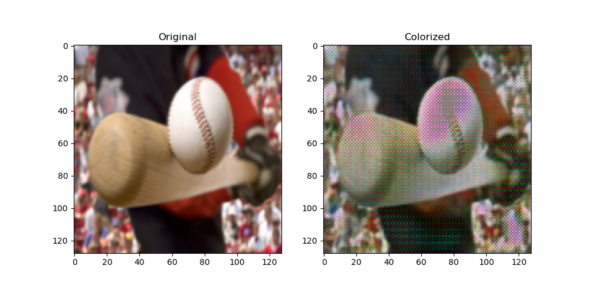
  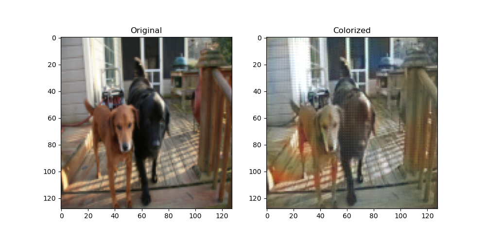
</p>


### The LAB colorspace

We spent a huge effort trying to make our model compatible to both LAB and RGB colorspaces. The former should have been better suited for our task in theory. 

Let's see why:
- ⏹️ The input grayscale image has 1 channel, as for RGB. 
- 🔼 The output of the baseline UNet is only on the $a,b$ channels, while $L$ must not be learned, but just concatenated.
- 🔼 The AdaIN encoder should just take $a,b$ channels as input, resulting in a more informative latent space

Unfortunately, in practice, we didn't record any improvement on the RGB counterpart at all. The colorisation was much more stable, but also gray-ish. And we completely lost the ability to perform color transfer.
Let's see the sibling training of the RGB-Latent32, that we presented at the [end of Section 5](#the-first-achievement-in-color-transfer).

<table align="center">
  <tr>
    <th>Train dataset size</th>
    <td>50.000</td>
  </tr>
  <tr>
    <th>Validation dataset size</th>
    <td>500</td>
  </tr>
  <tr>
    <th>Batch size</th>
    <td>16</td>
  </tr>
   <tr>
    <th>Colorspace</th>
    <td><span style="color:orange"> LAB</span></td>
  </tr>
  <tr>
    <th>AdaIN encoder latent space dimension</th>
    <td> 32</td>
  </tr>
  <tr>
    <th><span style="color:orange"> Dropout rate after every convolution</span></th>
    <td><span style="color:orange"> 0.2</span></td>
  </tr>
  <tr>
    <th>Epochs</th>
    <td>32</td>
  </tr>
</table>

In this particular case, we analize the histograms of the values of the latent space of the AdaIN encoder for different artistic images and we notice values all clustering around 0.5. We deduce therefore that the cause of the poor performance lies again in the lack of scarcity. The network is otherwise the same as its RGB counterpart, but is also much more efficient in the LAB framework.
We are aware that with further experiments, aimed at rebalancing the scarcity and the influence of the AdaIN layers, we might have obtained even better results than RGB. Unfortunately, the lack of tiime and resources forced us to take some decisions and we deemed more reasonable to invest time on perfecting the RGB network that gave us the first positive feedback on color transfer.

<p align="center">
  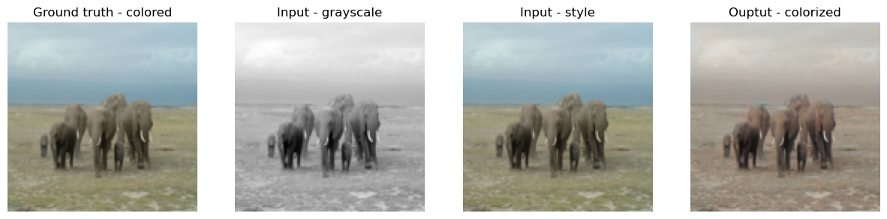
  
  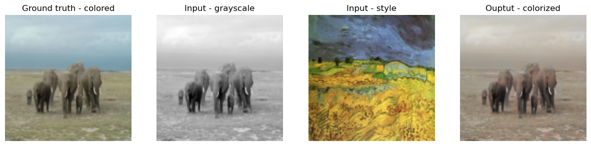
</p>


## Additional results

<h3 align='center'> Dog and Sheeps </p>
<p align="center">
  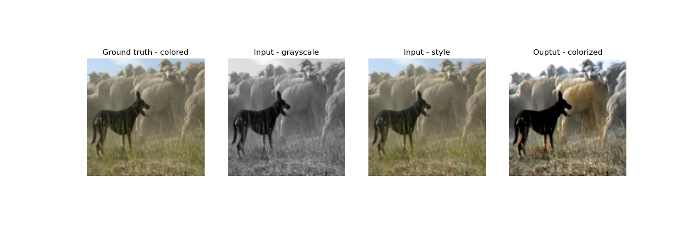
  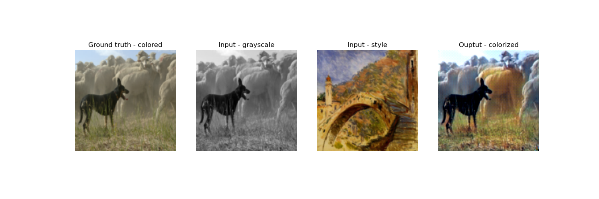
  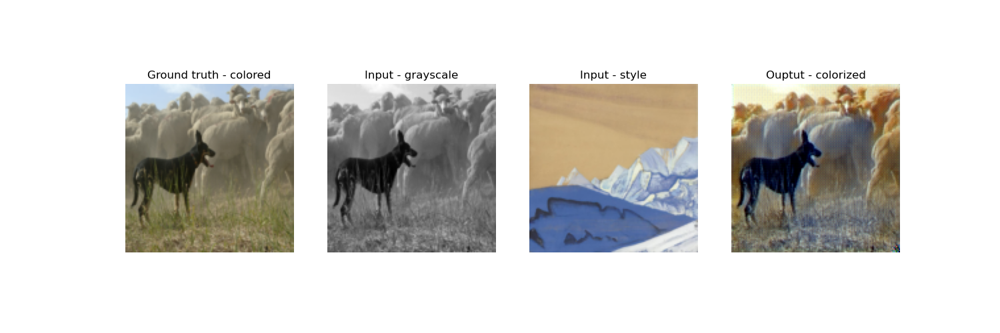
  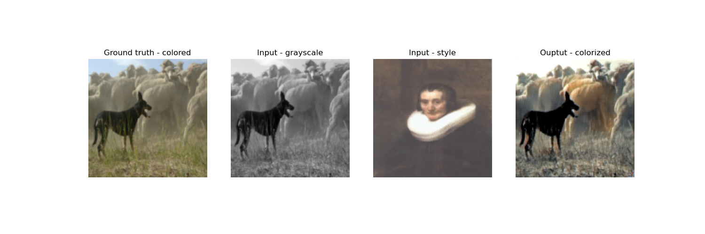
</p>

<h3 align='center'> Exotic bird </p>
<p align="center">
  
  
  
  
</p>

<h3 align='center'> Small dog in grass </p>
<p align="center">
  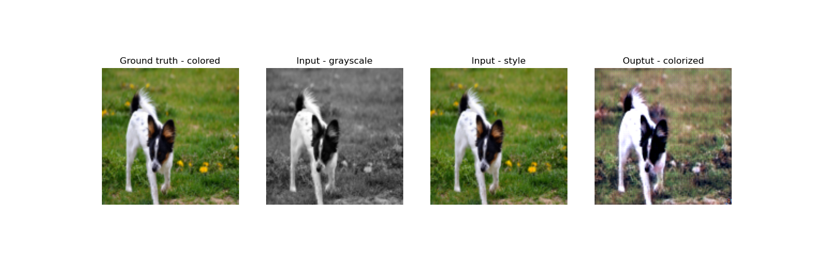
  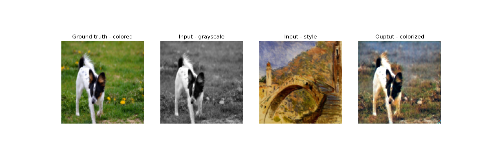
  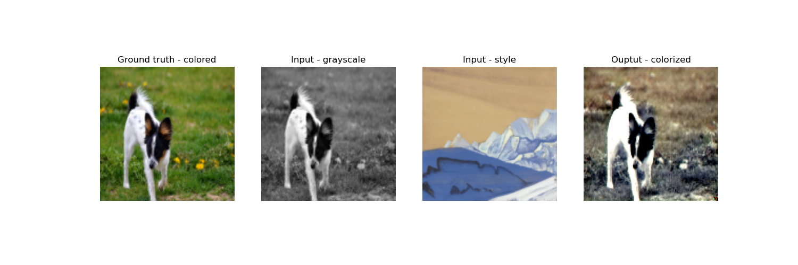
  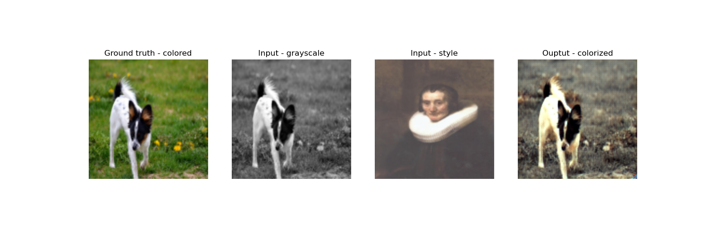
</p>

<h3 align='center'> Nature landscape </p>
<p align="center">
  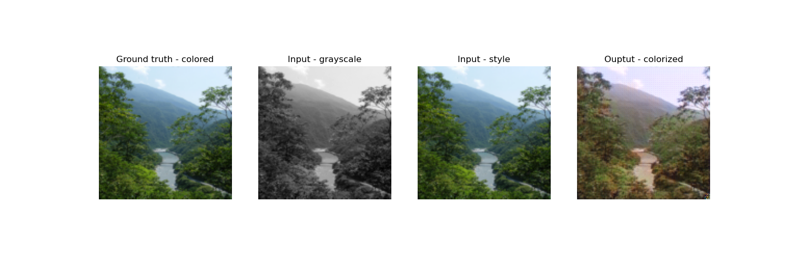
  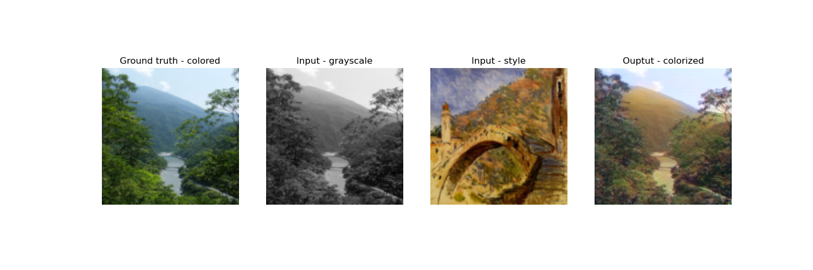
  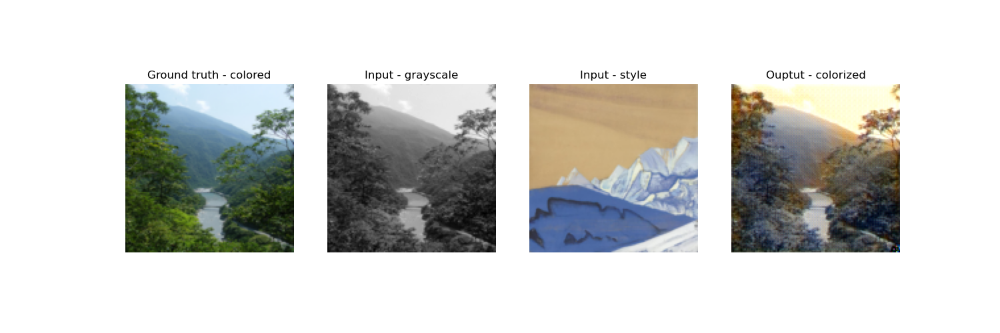
  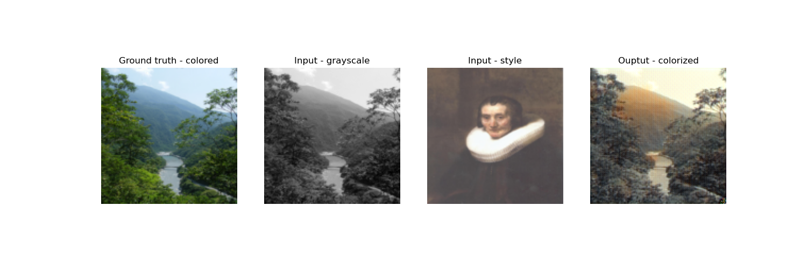
</p>

<h3 align='center'> Man </p>
<p align="center">
  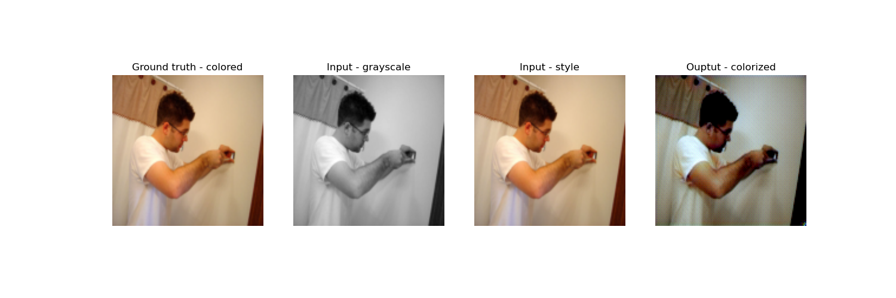
  
  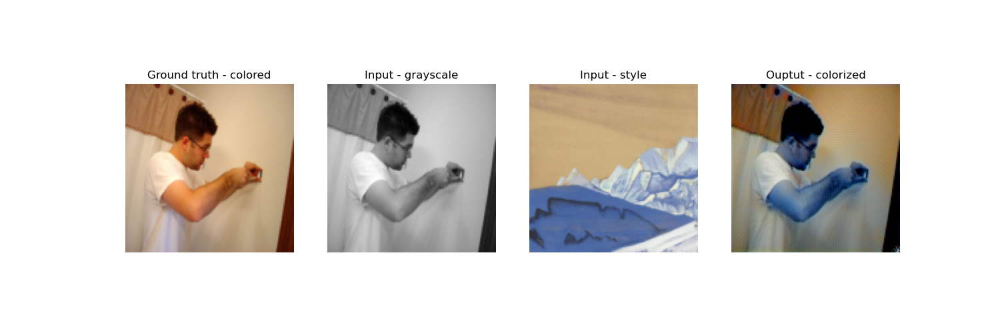
  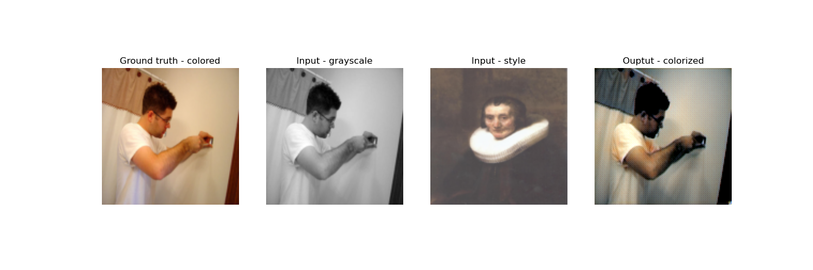
</p>
