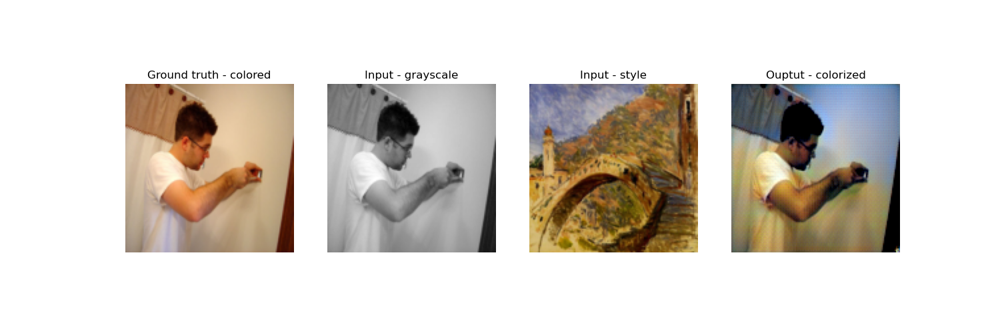

# Artistic colorisation with Adaptive Istance Normalization

### 🧑🏻‍🎓 Team Members

| Name and surname    |  Matric. Nr. | GitHub username  |   e-mail address   |
|:--------------------|:-------------|:-----------------|:-------------------|
| Cristi Andrei Prioteasa | 4740844| PrioteasaAndrei | cristi.prioteasa@stud.uni-heidelberg.de|
| Matteo Malvestiti | 4731243| Matteo-Malve | matteo.malvestiti@stud.uni-heidelberg.de|
| Jan Smoleń | 4734263| smolenj | wm315@stud.uni-heidelberg.de|


### Advisor

Denis Zavadski: denis.zavadski@iwr.uni-heidelberg.de

***

### Setup

```bash
conda env create -f environment.yml --name colorization
conda activate colorization
streamlit run gui/demo.py -- --model_path=models/RGB_Latent32_best_model.pth.tar
```
Use the graphical interface to upload style and contet images. The images will be automatically resized to $128px\times128px$. The model takes only 400 MB, so it should work on most low-end devices.

NOTE: a Huggingface token is needed to run the training / download the dataset (this is not necessary to run the forward pass of the network). Create a .env file in the main directory and add `HUGGING_FACE_TOKEN='YOUR TOKEN'`.

### Project Structure
```
├── gui <----------- streamlit app
├── images <---------- various images saved along the project developement
├── implicit-UNet-AdaIN <----------------- network and training
│   ├── implicit_scarsity_experiments <---------------- experiment results
│   ├── samples <-------------------- validation samples
│   └── samples_organized <--------------- validation samples in a more human readable format
├── models <---------------------- model checkpoint
└── Unet_adain <---------------------- older versions of the model checkpoints
    └── combined_losses_experiments
```

## Table of contents

1. [Introduction](#introduction)
2. [Results](#appendix)

# <a name="introduction"></a>1. Introduction

Colorization of grayscale images has been an area of significant interest in computer vision, with applications ranging from photo restoration to artistic expression. We propose an approach to colorize grayscale images in various artistic styles using a U-Net architecture enhanced with Adaptive Instance Normalization (AdaIN) layers. U-Net, known for its effectiveness in semantic segmentation tasks, provides an ideal framework for our colorization task due to its ability to capture spatial dependencies while preserving fine details. By incorporating AdaIN layers into the U-Net architecture, we introduce the capability to adaptively transfer artistic styles (here we use style to refer to color choices) from reference images to grayscale inputs. AdaIN enables the decoupling of content and style in feature representations, allowing us to leverage the content information from grayscale images while infusing them with the stylistic characteristics extracted from reference color images. This style-guided colorization approach opens up new possibilities for artistic expression, allowing users to apply various painting styles, from impressionism to surrealism, to grayscale inputs.

# <a name="appendix"></a>Results
<h3 align='center'> Dog and Sheeps </p>
<p align="center">
  
  
  
  
</p>

<h3 align='center'> Exotic bird </p>
<p align="center">
  
  
  
  
</p>

<h3 align='center'> Small dog in grass </p>
<p align="center">
  
  
  
  
</p>

<h3 align='center'> Nature landscape </p>
<p align="center">
  
  
  
  
</p>

<h3 align='center'> Man </p>
<p align="center">
  
  
  
  
</p>
